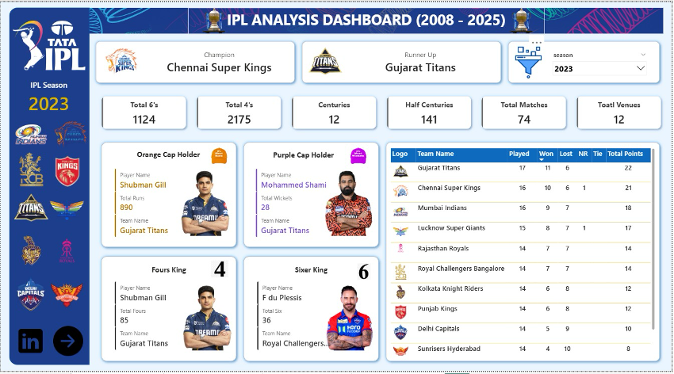
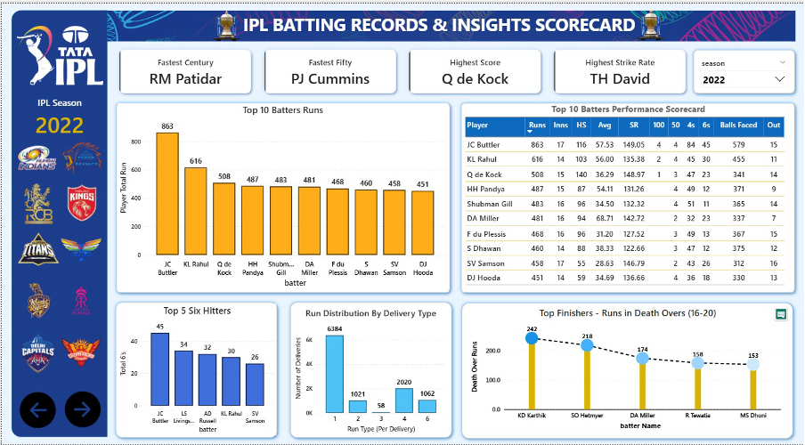
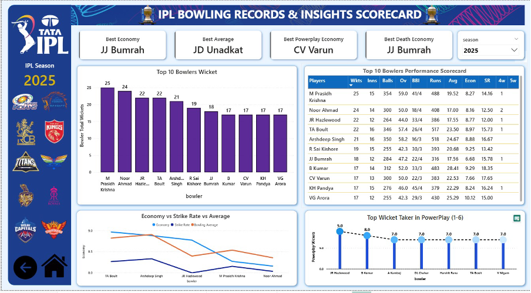
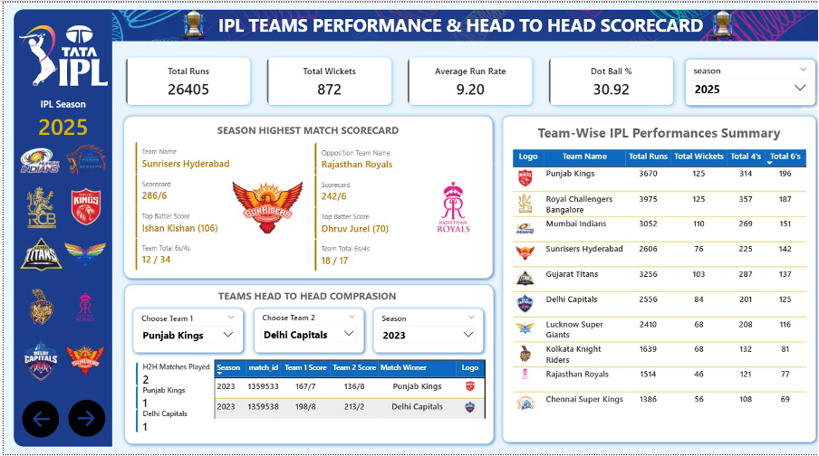

# 🏏 IPL Analysis Dashboard (2008–2025)

This project is an interactive Power BI dashboard built using IPL ball-by-ball data.

## 🔥 Features
- Team Performance Analysis
- Head-to-Head Comparison
- Batting Insights
- Bowling Insights
- Dynamic KPIs using DAX

## 📊 Tools Used
- Power BI
- DAX
- SQL (for understanding data)
- Python (for data handling basics)

## 📂 Dataset
https://www.kaggle.com/datasets/dgsports/ipl-ball-by-ball-2008-to-2022

## 🌐 Live Dashboard
 https://app.powerbi.com/links/ZNReHfEqoE?ctid=e14e73eb-5251-4388-8d67

## 📸 Dashboard Preview

### 🏆 Main Dashboard

### 🔥 Batting Insights

### 🎯 Bowling Insights

### 🤝 Team Head-to-Head Analysis

## 📊 Key Features

### 🏆 Season Overview
- Champion & Runner-up (Season-wise)
- Total 4s, 6s, Centuries & Half-Centuries
- Total Matches & Venues
- Points Table, Orange & Purple Cap holders
- Fours King & Sixer King

### 🤝 Team Performance & Head-to-Head
- Total Runs, Wickets & Avg Run Rate
- Season highest match scorecards
- Dynamic Team1 vs Team2 comparison
- Match-wise scorecards with winner logos
- Multi-season analysis support

### 🔥 Batting Insights
- Fastest 50 & 100
- Highest individual score & best strike rate
- Top run scorers & six hitters
- Death-over finishers analysis

### 🎯 Bowling Insights
- Best economy, average & strike rate
- Powerplay & death-over specialists
- Top wicket takers
- Economy vs Strike Rate vs Averagee vs Average
